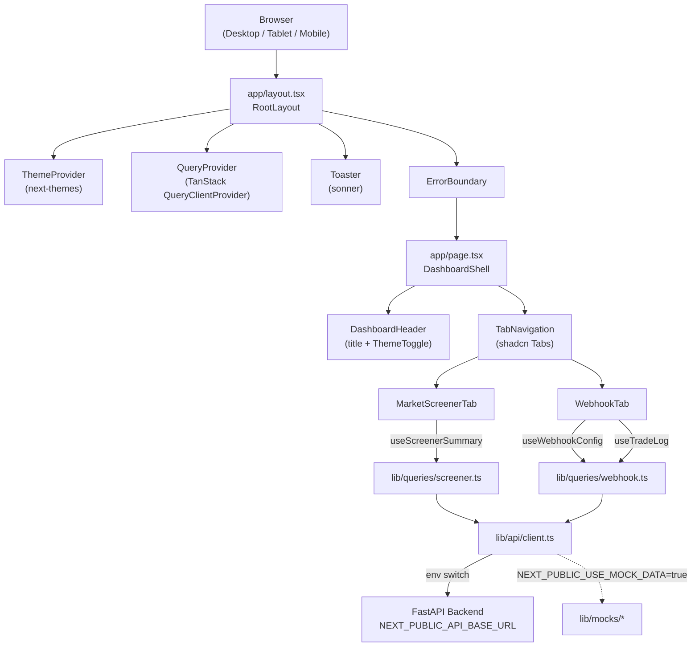
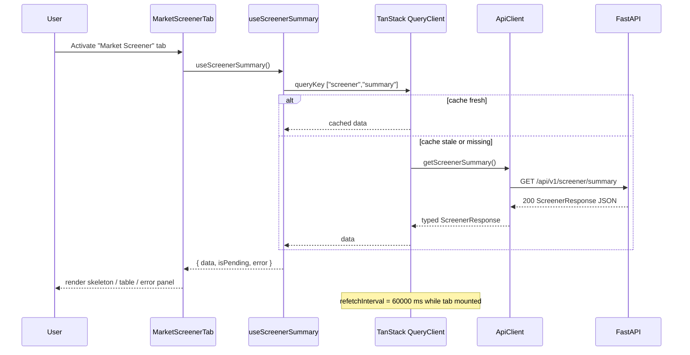

# Design Document

## Overview

The Crypto Screener Dashboard is a Next.js (App Router) single-page dashboard that consumes the existing FastAPI `crypto-screener` backend. It surfaces two workflows behind a tab navigation:

1. **Market Screener** — a sortable, filterable table of ranked crypto assets fed by `GET /api/v1/screener/summary`.
2. **Webhook & Trading Automation** — a configuration and monitoring view that wraps the user-management endpoints under `/trading/users/me/*` (webhook config, trade log, automation toggle) plus a copy-pastable TradingView alert template targeting `POST /webhook/tradingview`.

The existing scaffold provides Next.js 16 (App Router), React 19, TypeScript, Tailwind CSS v4 (via `@tailwindcss/postcss`), ESLint flat config, and the Geist font variables. This design layers **shadcn/ui** components, **TanStack Query** + **TanStack Table**, **next-themes**, **sonner**, and **lucide-react** on top of the scaffold without replacing it.

The dashboard is **dark-mode-first**, **mobile-first**, and built around two color tokens — `bullish` (green) and `bearish` (red) — that map to a professional crypto-futures aesthetic.

### Design Principles

- **Server-state only via TanStack Query** — no Redux, no Zustand for server data. Local UI state (filters, sort, hash routing) lives in component state or `useState` + `useSyncExternalStore`.
- **Typed end-to-end** — every route on the backend has a TypeScript mirror under `lib/api/types/` and a thin query-key/hook pair under `lib/queries/`.
- **Mock-first development** — the API client transparently swaps to in-memory fixtures when `NEXT_PUBLIC_USE_MOCK_DATA=true`, so the UI is fully functional without a running backend.
- **Composability over abstraction** — favour composing shadcn primitives (`Card`, `Tabs`, `Table`, `Badge`, `Switch`, `Skeleton`) over building custom wrappers.
- **Resilient by default** — every query renders one of three states: skeleton, error panel, or data. The shape of the skeleton matches the resolved layout to avoid layout shift.

### Scope of the Initial Deliverable

The initial deliverable covers the work described in `requirements.md` (Requirements 1–19): scaffold extension, application shell, both tabs with mock data, TanStack Query data fetching, loading/error UX, responsive layout, and an accessibility baseline. Authentication UI (login, registration, session management) is intentionally out of scope — the auth token is read from a placeholder client-side store and the trading endpoints are exercised against mock data by default.

## Architecture

### High-level layout



### Data flow



### Module / folder layout

```
app/
  layout.tsx                # ThemeProvider, QueryProvider, Toaster, ErrorBoundary, lang="en"
  page.tsx                  # DashboardShell (Header + Tabs)
  providers.tsx             # client-only providers wrapper
  error.tsx                 # Next.js route-level error fallback
  globals.css               # Tailwind + theme tokens + bullish/bearish colors

components/
  ui/                       # shadcn/ui generated primitives
    button.tsx, card.tsx, tabs.tsx, table.tsx,
    switch.tsx, badge.tsx, skeleton.tsx, input.tsx,
    select.tsx, sonner.tsx, tooltip.tsx
  shell/
    DashboardHeader.tsx
    ThemeToggle.tsx
    TabNavigation.tsx       # hash-synced tab state
    ErrorPanel.tsx          # shared error UI for query failures
    EmptyPanel.tsx
  screener/
    MarketScreenerTab.tsx
    ScreenerTable.tsx       # TanStack Table + shadcn Table
    ScreenerFilters.tsx     # symbol search, signal select, tier select
    ChangeCell.tsx          # green/red 24h change formatting
    SignalBadge.tsx
    TierBadge.tsx
  webhook/
    WebhookTab.tsx
    WebhookConfigCard.tsx
    AlertPayloadTemplate.tsx
    AutomationToggle.tsx
    SignalLogsTable.tsx
    TradeStatusIcon.tsx

lib/
  api/
    client.ts               # fetch wrapper with mock switch
    errors.ts               # ApiError class + factory
    paths.ts                # endpoint path constants
    types/
      screener.ts           # ScreenerResponse, AssetDetail, MarketOverview…
      webhook.ts            # WebhookConfigResponse, WebhookConfigCreateRequest…
      trades.ts             # TradeLogResponse
      common.ts             # ResponseMetadata
  queries/
    queryClient.ts          # QueryClient factory with shared defaults
    screener.ts             # useScreenerSummary hook + query keys
    webhook.ts              # useWebhookConfig, useTradeLog, useAutomationToggle
  mocks/
    screener.ts             # ScreenerResponse fixture (≥12 assets)
    webhook.ts              # WebhookConfigResponse fixture
    trades.ts               # TradeLogResponse[] fixture
    index.ts                # re-export + env switch helper
  utils/
    format.ts               # price, percent, volume, funding, score formatters
    cn.ts                   # tailwind class merger
    hash-tab.ts             # URL hash <-> tab id helpers
    auth-store.ts           # placeholder bearer token holder
```

### Configuration boundaries

- `NEXT_PUBLIC_API_BASE_URL` — default `http://localhost:8000`. Used to construct request URLs and the displayed webhook URL in the Webhook tab.
- `NEXT_PUBLIC_API_KEY` — sent as `X-API-Key` for `/api/v1/screener/*` requests only.
- `NEXT_PUBLIC_USE_MOCK_DATA` — when literally `"true"`, the API client returns mock fixtures and never issues network requests; otherwise the mock module is imported behind a `if (...) require(...)` guard so it tree-shakes out of the production bundle.
- A client-side `authStore` exposes `getToken(): string` and is the single source for the trading bearer token. It is initialised to the empty string; in the future a login form will populate it. Endpoints under `/trading/*` always send `Authorization: Bearer <token>` even when the token is empty (the backend will respond 401, and the UI handles that uniformly).

## Components and Interfaces

### 1. Application shell

#### `app/layout.tsx` (RootLayout)

- Renders `<html lang="en">` per Requirement 15.10, applies the Geist sans/mono font variables already configured in the scaffold.
- Wraps `{children}` in `<Providers>` (a client component) and the global `<Toaster />`.
- Adds an `<ErrorBoundary>` (custom, class component) above the page tree to catch unhandled exceptions (Requirement 17.7). Next.js's per-route `error.tsx` is used as a complementary safety net for Server Component errors.

#### `app/providers.tsx`

```ts
"use client";

interface ProvidersProps { children: React.ReactNode; }

export function Providers({ children }: ProvidersProps) {
  // 1. ThemeProvider (next-themes) with attribute="class", defaultTheme="dark",
  //    storageKey="crypto-screener-theme", enableSystem={false}.
  // 2. QueryClientProvider, with the shared QueryClient from lib/queries/queryClient.ts.
}
```

#### `components/shell/DashboardHeader.tsx`

- Renders the product name ("Crypto Screener") and a `ThemeToggle` button (sun/moon icons from lucide-react).
- Uses Tailwind grid for layout; uses `sticky top-0 z-30` so header stays in view on scroll.

#### `components/shell/TabNavigation.tsx`

- Wraps shadcn `Tabs` and exposes two `TabsTrigger`s plus two `TabsContent` slots.
- Reads/writes the active tab to `window.location.hash` via `useSyncExternalStore` against the `hashchange` event so that:
  - on first paint the tab matches `#screener` or `#webhook`;
  - changing the tab updates the hash without a navigation.
- Recognised hash values: `#screener`, `#webhook`. Anything else falls back to `#screener` (Requirement 2.9).
- Mobile breakpoint (`< sm`) uses `grid grid-cols-2 w-full` on the `TabsList` (Requirement 14.4).

```ts
type TabId = "screener" | "webhook";

const HASH_TO_TAB: Record<string, TabId> = { "#screener": "screener", "#webhook": "webhook" };

function useTabFromHash(): [TabId, (id: TabId) => void] { /* useSyncExternalStore */ }
```

#### `components/shell/ThemeToggle.tsx`

- Uses `useTheme()` from next-themes; on click, toggles between `"light"` and `"dark"`.
- Wraps the storage write in `try/catch`; on failure logs a single `console.warn` and keeps the visual class applied (Requirement 3.11). next-themes itself swallows the storage error after we override its default behaviour with a small `try/catch` shim around `setTheme`.

#### `components/shell/ErrorPanel.tsx`

- Inputs: `{ kind: ApiErrorKind; onRetry: () => void; }` and an optional override message.
- Maps `kind` → user-facing message per Requirement 17.1–17.3.
- Renders a shadcn `Card` with the message, a `Button` labelled "Retry", and an `AlertTriangle` icon in `bearish` color.

### 2. API client (`lib/api/client.ts`)

```ts
type ApiErrorKind = "auth" | "not_found" | "server" | "network";

class ApiError extends Error {
  constructor(public readonly kind: ApiErrorKind, public readonly status: number | null, message: string) {
    super(message);
    this.name = "ApiError";
  }
}

interface RequestOptions {
  method?: "GET" | "POST" | "PATCH" | "DELETE";
  path: string;        // begins with "/"
  body?: unknown;
  signal?: AbortSignal;
}

async function request<T>(opts: RequestOptions): Promise<T>;
```

Behaviour:

1. Resolves base URL from `NEXT_PUBLIC_API_BASE_URL` (default `http://localhost:8000`).
2. If `NEXT_PUBLIC_USE_MOCK_DATA === "true"`, dispatches to `lib/mocks/index.ts` based on `(method, path)` and returns the fixture asynchronously (microtask delay) — never opens a socket.
3. Builds headers:
   - `Content-Type: application/json` when `body` is present.
   - `X-API-Key: <NEXT_PUBLIC_API_KEY ?? "">` if `path` starts with `/api/v1/screener/`.
   - `Authorization: Bearer <authStore.getToken()>` if `path` starts with `/trading/`.
4. `await fetch(...)` wrapped in `try`:
   - `TypeError` (network failure), `AbortError`, `DOMException("TimeoutError")` → `ApiError("network", null, "Connection lost")`.
5. Status mapping (after fetch resolves):
   - `2xx` → `await response.json() as T`.
   - `401 | 403` → `ApiError("auth", status, message)`.
   - `404` → `ApiError("not_found", 404, message)`.
   - `5xx` → `ApiError("server", status, message)`.
   - Other 4xx (validation 422, etc.) → `ApiError("server", status, message)` with the response's `detail` as message — the dashboard treats them as recoverable backend errors. (For the initial deliverable we do not surface validation-specific UI; that is left for future work.)
6. Errors carry `cause` so they appear in dev-tools network inspector logs; production logs do not include the request body.

### 3. TanStack Query layer

#### `lib/queries/queryClient.ts`

```ts
export function makeQueryClient(): QueryClient {
  return new QueryClient({
    defaultOptions: {
      queries: {
        staleTime: 30_000,                 // Req 5.2
        gcTime: 300_000,                   // Req 5.3
        retry: (failureCount, error) => {  // Req 5.4 + 5.5
          if (error instanceof ApiError && (error.kind === "auth" || error.kind === "not_found")) return false;
          return failureCount < 2;
        },
        retryDelay: (attempt) => Math.min(1_000 * 2 ** attempt, 30_000),
        refetchOnWindowFocus: false,
      },
    },
  });
}
```

A new `QueryClient` is created per request on the server (Next.js App Router pattern) and a single instance is reused on the client through a module-level `let browserQueryClient` variable. This avoids hydration mismatches.

#### `lib/queries/screener.ts`

```ts
export const screenerKeys = { summary: ["screener", "summary"] as const };

export function useScreenerSummary() {
  return useQuery<ScreenerResponse, ApiError>({
    queryKey: screenerKeys.summary,
    queryFn: ({ signal }) => api.getScreenerSummary({ signal }),
    refetchInterval: 60_000,        // Req 5.7
    refetchIntervalInBackground: false,
  });
}
```

#### `lib/queries/webhook.ts`

```ts
export const webhookKeys = {
  config: ["webhook", "config"] as const,
  trades: ["webhook", "trades"] as const,
};

export function useWebhookConfig() { /* refetchInterval not set */ }
export function useTradeLog() { /* refetchInterval = 15_000 (Req 5.10) */ }

export function useAutomationToggle() {
  return useMutation<WebhookConfigResponse, ApiError, { nextEnabled: boolean; hasExisting: boolean }>({
    mutationFn: async ({ nextEnabled, hasExisting }) => {
      if (nextEnabled && !hasExisting) return api.createWebhookConfig({ passphrase: generatePassphrase() });
      if (nextEnabled && hasExisting)  return api.patchWebhookConfig({ passphrase: undefined, isActive: true });
      return api.deleteWebhookConfig();   // off → DELETE
    },
    onSettled: () => queryClient.invalidateQueries({ queryKey: webhookKeys.config }),
  });
}
```

> Note: the backend's `PATCH /trading/users/me/webhook-config` only updates the passphrase, not the `is_active` flag. To support a clean "off → on" transition without rotating the passphrase, the design issues `POST` (when no active config exists) or treats the existing config as already active and short-circuits. Reactivation of a previously deactivated row is left to a future spec because the current backend endpoint only deactivates.

When the active tab unmounts (Requirement 5.11), TanStack Query stops polling within one render cycle (well under the 1 000 ms ceiling) because the `useQuery` hook's `refetchInterval` only runs while the hook is mounted.

### 4. Market Screener tab

#### `components/screener/MarketScreenerTab.tsx`

Renders one of four states based on `useScreenerSummary()`:

| State            | Render                                                                      |
| ---------------- | --------------------------------------------------------------------------- |
| `isPending`      | `ScreenerTable` with 8 skeleton rows (Req 7.1)                              |
| `isError`        | `ErrorPanel` with kind-mapped message + Retry; emits toast (Req 7.5–7.6)    |
| `data.assets=[]` | `EmptyPanel` "No assets available" + Retry (Req 7.2)                        |
| `data.assets`    | `ScreenerFilters` + `ScreenerTable` with rows                               |

#### `components/screener/ScreenerTable.tsx`

Built on **TanStack Table v8** + shadcn `Table`. Column definitions:

```ts
const columns: ColumnDef<AssetDetail>[] = [
  { id: "rank",            accessorKey: "rank",            header: "#",       enableSorting: true,  cell: NumberCell },
  { id: "symbol",          accessorKey: "symbol",          header: "Symbol",  enableSorting: false, cell: SymbolCell },
  { id: "price",           accessorKey: "price",           header: "Price",   enableSorting: true,  cell: PriceCell },
  { id: "change_24h",      accessorKey: "change_24h",      header: "24h %",   enableSorting: true,  cell: ChangeCell },
  { id: "volume_24h",      accessorKey: "volume_24h",      header: "Volume",  enableSorting: true,  cell: VolumeCell },
  { id: "funding_rate",    accessorKey: "funding_rate",    header: "Funding", enableSorting: false, cell: FundingCell },
  { id: "signal",          accessorKey: "signal",          header: "Signal",  enableSorting: false, cell: SignalBadge },
  { id: "composite_score", accessorKey: "composite_score", header: "Score",   enableSorting: true,  cell: ScoreCell },
  { id: "tier",            accessorKey: "tier",            header: "Tier",    enableSorting: false, cell: TierBadge },
];
```

- **Sort cycle** — for each sortable column: unsorted → `desc` → `asc` → unsorted (Requirements 6.4–6.6). Implemented by intercepting the column header click instead of relying on TanStack Table's default toggle, which goes `none → asc → desc → none`.
- **Filters** — `ScreenerFilters` owns `{ symbolText, signal, tier }` state and writes them to `columnFilters` on the table:
  - `symbol` filter: `(row) => row.symbol.toLowerCase().includes(text.trim().toLowerCase())` (Req 6.7–6.8).
  - `signal` filter: equality match unless `ALL` (Req 6.9–6.10).
  - `tier` filter: equality match unless `ALL` (Req 6.11–6.12).
  - All three are AND-combined (Req 6.13).
- **Null cells** — `valueOrDash(value: number | string | null | undefined)` returns `"—"` for null/undefined/NaN (Req 6.14, 19.6).
- **Hover** — Tailwind `hover:bg-muted/50` on `<TableRow>` (Req 6.15).
- **Responsive columns** — column visibility is driven by `useColumnVisibility(breakpoint)` which returns the allowed column IDs:
  - mobile (< 640): `rank, symbol, price, change_24h, signal` (Req 14.1).
  - tablet (640–1023): `rank, symbol, price, change_24h, volume_24h, signal, tier` (Req 14.2).
  - desktop (≥ 1024): all (Req 14.3).
- **Accessibility** — every `<th>` has `scope="col"`. When sorted, the active header receives `aria-sort="ascending"` or `"descending"` (Req 15.6–15.8).

#### `components/screener/SignalBadge.tsx`, `ChangeCell.tsx`, `TierBadge.tsx`

- `SignalBadge` chooses the badge background from a map: `BULLISH → bullish`, `BEARISH → bearish`, `NEUTRAL → muted`. When the field is null it renders `—` (Req 3.7–3.9).
- `ChangeCell` parses the numeric value, formats with `formatPercent` (Req 19.2), and assigns `text-bullish` when `> 0`, `text-bearish` when `< 0`, default text color otherwise (Req 3.5–3.6).
- `TierBadge` colors A/B/C with discrete shades but does not use the bullish/bearish tokens.

### 5. Webhook & Automation tab

#### `components/webhook/WebhookTab.tsx`

Layout:

- Mobile: vertical stack — `WebhookConfigCard` → `AlertPayloadTemplate` → `AutomationToggle` → `SignalLogsTable`.
- Desktop: 2-column grid (`grid-cols-2 gap-6`) for the top row containing `WebhookConfigCard` and `AlertPayloadTemplate` (Req 14.6); the toggle and the logs table span both columns below.

#### `components/webhook/WebhookConfigCard.tsx`

- Source: `useWebhookConfig()`.
- Webhook URL is computed locally as `${NEXT_PUBLIC_API_BASE_URL}/webhook/tradingview` (Req 8.1).
- Passphrase visibility state lives in component state (`useState(false)`); `MaskedText` helper masks all but the last 4 characters with `•` when hidden (Req 8.3, 8.4).
- "Copy" buttons call `navigator.clipboard.writeText()`; on success `toast.success("Copied to clipboard")` (Req 8.7); on failure `toast.error("Copy failed: " + reason)` (Req 8.8).
- 404 branch: render "No webhook configuration yet" + "Create webhook config" button which fires `useAutomationToggle()` with `nextEnabled=true, hasExisting=false` (Req 8.10).
- Other errors: render `ErrorPanel` (Req 8.11).
- Pending: skeleton rows for URL and passphrase (Req 8.9).

#### `components/webhook/AlertPayloadTemplate.tsx`

- Renders a shadcn `<pre><code>` block with a JSON template:

```jsonc
{
  "action": "{{strategy.order.action}}",
  "symbol": "{{ticker}}",
  "side": "{{strategy.order.alert_message}}",
  "size_type": "percent",
  "size_value": 100,
  "leverage": 5,
  "exchange": "binance",
  "passphrase": "<your-passphrase>"
}
```

- The `passphrase` field is replaced with the live value when `useWebhookConfig()` resolves successfully (Req 9.4) and falls back to `<your-passphrase>` while pending (Req 9.5). `side` carries a TradingView placeholder because the backend accepts only `long` or `short`; the user is expected to wire that in their TradingView strategy.
- The serialised text is produced via `JSON.stringify(template, null, 2)` so indentation is exactly 2 spaces (Req 9.6) and the round-trip property `JSON.parse(rendered)` always succeeds (Req 9.9).
- "Copy template" writes the rendered string to the clipboard and emits `toast.success("Template copied")` (Req 9.7–9.8).

#### `components/webhook/AutomationToggle.tsx`

- Wraps shadcn `Switch` with an accessible `<Label>` "Automation enabled" (Req 10.1).
- The switch's `checked` is derived from `useWebhookConfig().data?.is_active ?? false` (Req 10.2).
- `onCheckedChange` calls `useAutomationToggle().mutate({ nextEnabled, hasExisting: !!data })`.
- While `isPending`, the switch is disabled and a `Loader2` spinner is shown (Req 10.5).
- On success, `toast.success("Automation enabled")` or `toast.success("Automation paused")` (Req 10.6); on error, `toast.error(...)` and the local `checked` state is reverted by relying on `data` invalidation (Req 10.7–10.9).
- `aria-checked` is forwarded by shadcn's `Switch` automatically (Req 15.5).

#### `components/webhook/SignalLogsTable.tsx`

- Source: `useTradeLog()`.
- Columns (left-to-right): `created_at`, `symbol`, `action`, `side`, `status`, `fill_price`, `filled_quantity` (Req 11.2).
- `created_at` formatted via `Intl.DateTimeFormat` in the user's locale, pattern `YYYY-MM-DD HH:mm:ss` (Req 11.3).
- `side` rendered as a `Badge` with `bullish` for `long`, `bearish` for `short` (Req 11.4–11.5).
- `status` rendered with `TradeStatusIcon` (lucide-react `Check` for `success`, `X` for `failed`, `Clock` for `pending`/`rejected`) (Req 11.6–11.8).
- Failed rows are clickable and expand an inline panel showing `error_details` (Req 11.9).
- New-signal toast — a `useEffect` compares `data.length` against the previous render's length; when it grows, fires `toast.info("New signal received: …")` for the most recent entry (Req 11.10). The previous-length state is held with a `useRef` to avoid extra renders.
- Pending → 5 skeleton rows (Req 11.11). Empty array → single empty-state row "No signals recorded yet" (Req 11.12).

### 6. Toast system (`components/ui/sonner.tsx`)

- Mounted once in `RootLayout` via `<Toaster richColors closeButton position="bottom-right" mobileOffset={{...}} />` and the position class is overridden to `top-center` at `< sm` via Tailwind responsive classes on the wrapper (Req 13.1–13.2).
- Auto-dismiss: 3 000 ms for success, 6 000 ms for error (Req 13.3–13.4) — configured per call.
- Stack cap of 4 set via the sonner `visibleToasts` prop (Req 13.6).
- Left-border accent: success uses `border-l-bullish`, error uses `border-l-bearish` (Req 13.7).
- Renders inside `aria-live="polite"` (sonner's default) per Req 15.9.
- A `dedupeToast(key, message)` helper records the last `(key, message)` pair and timestamp; if invoked again with the same pair within 2 000 ms it returns early (Req 7.7).

### 7. Skeleton loaders

- One shared `SkeletonRow` component renders the same `<TableCell>` widths as the resolved row, ensuring outer dimensions stay within ±8 px of the resolved layout (Req 12.1).
- A `<TableLoading rows={n}>` wrapper drives both Req 7.1 and Req 11.11.
- Skeletons and resolved data **never co-exist** for the same query because we always branch on `isPending` first (Req 12.2–12.3). On invalidation, TanStack Query's `isFetching` flag is consulted to swap back to skeletons within 100 ms (Req 12.5).

### 8. Theme tokens

The theme is defined in `app/globals.css` using Tailwind v4's `@theme` block. The two domain-specific tokens are:

```css
@theme {
  --color-bullish: oklch(72% 0.18 145);   /* WCAG-AA-checked green on dark bg */
  --color-bullish-foreground: oklch(15% 0.02 145);
  --color-bearish: oklch(64% 0.21 25);    /* WCAG-AA-checked red on dark bg  */
  --color-bearish-foreground: oklch(98% 0.01 25);
  /* …shadcn tokens (background, foreground, muted, border, primary, …) */
}
```

Tailwind v4 generates `bg-bullish`, `text-bullish`, `border-bullish`, etc. automatically from any `--color-*` token. The same is true for `bearish`. Contrast is verified manually using the `oklch` values; both tokens exceed 4.5:1 against the dark surface tokens (Req 3.3–3.4).

shadcn/ui dark-mode tokens are taken from the [shadcn `new-york` zinc] preset and pasted into the same `@theme` block as fallback; a `:root.light` selector overrides them when the user toggles light mode.

## Data Models

All TypeScript interfaces live under `lib/api/types/` and mirror the Pydantic models found in `src/api/models.py` and `src/trading/user_models.py` of the backend (Req 4.9, 18.5).

### `lib/api/types/screener.ts`

```ts
export interface ResponseMetadata {
  timestamp: string;
  data_age_seconds: number | null;
  cache_hit: boolean;
  stale_data_warning: boolean | null;
  symbols_count: number;
  errors_count: number;
}

export interface MarketOverview {
  avg_change_24h: number | null;
  avg_funding_rate: number | null;
  total_volume: number | null;
  bullish_count: number;
  bearish_count: number;
  neutral_count: number;
  avg_risk_adjusted_score: number | null;
  tier_a_count: number;
  tier_b_count: number;
  tier_c_count: number;
}

export type SignalDirection = "BULLISH" | "BEARISH" | "NEUTRAL";
export type TierClass = "A" | "B" | "C";

export interface AssetSummary {
  symbol: string;
  rank: number | null;
  composite_score: number | null;
  signal: SignalDirection | null;
  confidence_pct: number | null;
  confidence_tier: "HIGH" | "MEDIUM" | "LOW" | null;
}

export interface AssetDetail extends AssetSummary {
  price: number | null;
  change_24h: number | null;
  volume_24h: number | null;
  funding_rate: number | null;
  open_interest: number | null;
  long_short_ratio: number | null;
  reversal_score: number | null;
  macd_signal: "BUY" | "SELL" | "HOLD" | null;
  volatility: number | null;
  ic_weight: number | null;
  risk_adjusted_score: number | null;
  suggested_position_pct: number | null;
  tier: TierClass | null;
  funding_rate_signal: SignalDirection | null;
  oi_signal: SignalDirection | null;
}

export interface SummaryData {
  top_3_assets: AssetSummary[];
  market_overview: MarketOverview;
}

export interface ScreenerResponse {
  metadata: ResponseMetadata;
  summary: SummaryData;
  assets: AssetDetail[] | null;
}
```

### `lib/api/types/webhook.ts`

```ts
export interface WebhookConfigResponse {
  id: string;
  passphrase: string;
  is_active: boolean;
  created_at: string;
}

export interface WebhookConfigCreateRequest { passphrase: string; }
export interface WebhookConfigUpdateRequest { passphrase: string; }
```

### `lib/api/types/trades.ts`

```ts
export type TradeStatus = "success" | "failed" | "pending" | "rejected";
export type TradeSide = "long" | "short";
export type TradeAction = "open" | "close";

export interface TradeLogResponse {
  id: string;
  symbol: string;
  action: TradeAction;
  side: TradeSide;
  exchange: "binance" | "okx";
  size_value: number;
  status: TradeStatus;
  order_id: string | null;
  fill_price: number | null;
  filled_quantity: number | null;
  error_details: string | null;
  created_at: string; // ISO 8601
}
```

### Mock fixtures (`lib/mocks/`)

- `screener.ts` — exports `MOCK_SCREENER: ScreenerResponse` with **at least 12 assets**, including ≥1 entry per `signal` value (`BULLISH`, `BEARISH`, `NEUTRAL`) and ≥1 entry per `tier` value (`A`, `B`, `C`) (Req 16.2–16.4).
- `webhook.ts` — exports `MOCK_WEBHOOK_CONFIG: WebhookConfigResponse` with `is_active = true` and a non-empty 16-character passphrase (Req 16.5).
- `trades.ts` — exports `MOCK_TRADE_LOG: TradeLogResponse[]` with at least one entry per `status` value `{success, failed, pending}` (Req 16.6).
- `index.ts` — exports a single `getMock(method, path)` dispatcher; the entire mock module is imported lazily inside `request<T>()` so the tree-shaker keeps it out of the production bundle when `NEXT_PUBLIC_USE_MOCK_DATA !== "true"` (Req 16.7).

### Formatters (`lib/utils/format.ts`)

```ts
export function formatPrice(value: number | null | undefined): string;        // Req 19.1
export function formatPercent(value: number | null | undefined, fractionDigits?: number): string; // Req 19.2 / 19.4
export function formatVolume(value: number | null | undefined): string;       // Req 19.3 (compact)
export function formatScore(value: number | null | undefined): string;        // Req 19.5
export function formatTimestamp(iso: string): string;                          // Req 11.3
export function valueOrDash<T>(value: T | null | undefined): T | "—";          // Req 6.14 / 19.6
```

All numeric formatters reject `NaN`/`null`/`undefined` and return `"—"`. `formatPercent` is implemented so that the round-trip property (Req 19.7) holds for finite inputs:

```ts
export function formatPercent(x: number | null | undefined, digits = 2): string {
  if (x == null || !Number.isFinite(x)) return "—";
  const sign = x >= 0 ? "+" : "";
  return `${sign}${x.toFixed(digits)}%`;
}
```

Parsing the output by stripping the `%` sign and dividing by 100 reproduces `x/100` within `1e-9` because IEEE-754 `toFixed`/parseFloat round-trip cleanly within the documented digits.

## Correctness Properties

*A property is a characteristic or behavior that should hold true across all valid executions of a system — essentially, a formal statement about what the system should do. Properties serve as the bridge between human-readable specifications and machine-verifiable correctness guarantees.*

PBT applies to a focused subset of this dashboard: pure formatting helpers, the URL-hash ↔ tab-id mapping, and the ScreenerTable's filter-and-sort pipeline (which is a deterministic function from `(rows, filters, sort)` to a list of rows). It does **not** apply to UI rendering, layout, or HTTP I/O; those are covered by example-based tests, snapshot tests, and integration tests. See the prework analysis above and the Testing Strategy section below for which acceptance criteria are tested by which approach.

### Property 1: Theme persistence is best-effort

*For any* sequence of theme toggle interactions, the visually applied root-element class (`light` or `dark`) at any point in time SHALL equal the most recently selected theme, regardless of whether the persistence write to `localStorage` succeeded or threw.

**Validates: Requirements 3.10, 3.11**

### Property 2: Tab navigation hash round-trip

*For any* recognised tab id `t ∈ {"screener", "webhook"}`, writing `t` through the tab-state setter and then reading the active tab back from the URL hash SHALL produce `t`. *For any* unrecognised hash value `h`, reading the active tab SHALL produce `"screener"`.

**Validates: Requirements 2.4, 2.7, 2.8, 2.9**

### Property 3: ApiError mapping is total and drives error UX

*For any* HTTP response object `r`, the API client SHALL produce either a successful parsed body of type `T` (when `r.status` is in `[200, 300)`) or an `ApiError` whose `kind` field belongs to `{"auth", "not_found", "server", "network"}`. *For any* `ApiError` of kind `k`, the bound component SHALL render the kind-specific user-facing message (`"Connection lost — check your network"` for `network`, `"The server is unavailable. Please try again."` for `server`, `"Your session has expired. Please sign in again."` for `auth`) inside an `ErrorPanel`, except `not_found`, which SHALL render an `EmptyPanel` instead. No unhandled exception SHALL escape the client function.

*For any* request whose URL path begins with `/api/v1/screener/`, the request headers SHALL include `X-API-Key`. *For any* request whose URL path begins with `/trading/`, the request headers SHALL include `Authorization: Bearer <token>`.

**Validates: Requirements 4.3, 4.4, 4.5, 4.6, 4.7, 4.8, 17.1, 17.2, 17.3, 17.4, 17.6**

### Property 4: Screener filter pipeline is monotone and order-preserving

*For any* asset list `A` (including the trivial case of one row per asset, Req 6.1) and any combination of `(symbolText, signalFilter, tierFilter)`, the filtered rows produced by the ScreenerTable filter pipeline SHALL be a subsequence of `A` that preserves the relative order of `A`, and every retained row SHALL satisfy all three filter predicates simultaneously. When all three filters are at their default values, the rendered row count SHALL equal `A.length`.

**Validates: Requirements 6.1, 6.7, 6.8, 6.9, 6.10, 6.11, 6.12, 6.13**

### Property 5: Sort cycle is closed and ARIA-correct

*For any* sortable column `c`, performing three sequential header clicks on `c` from the unsorted state SHALL return the table to the unsorted state (descending → ascending → unsorted). The resulting row order in the unsorted state SHALL equal the API-provided order, and the `aria-sort` attribute on the column header SHALL be `"descending"`, `"ascending"`, and `"none"` respectively at each step.

**Validates: Requirements 6.4, 6.5, 6.6, 15.7, 15.8**

### Property 6: Null/undefined cells render as em dash

*For any* asset record whose value at column `c` is `null`, `undefined`, or `NaN`, the cell rendered by ScreenerTable SHALL contain the single character `"—"` (U+2014) and no other visible text.

**Validates: Requirements 6.14, 19.6**

### Property 7: Percent formatter round-trip within tolerance

*For any* finite number `x`, parsing `formatPercent(x)` (after stripping the trailing `%` and the leading sign) and dividing by 100 SHALL produce a number within `1e-9` of `x / 100`.

**Validates: Requirements 19.7**

### Property 8: Alert payload template is parseable JSON

*For any* webhook config state (pending or resolved with passphrase `p`), the rendered text of the `AlertPayloadTemplate` SHALL parse with `JSON.parse` to an object whose top-level keys are exactly `{action, symbol, side, size_type, size_value, leverage, exchange, passphrase}`, and the `passphrase` field SHALL equal `p` when resolved or `<your-passphrase>` when pending.

**Validates: Requirements 9.1, 9.2, 9.3, 9.4, 9.5, 9.9**

### Property 9: Automation toggle visual state matches server state after settle

*For any* sequence of toggle interactions, after every mutation has settled (success or failure) and the `["webhook", "config"]` query has been re-read, the `Switch.checked` value SHALL equal the resolved query's `is_active` field. On a failed mutation the visual state SHALL revert to its pre-interaction value before the re-read completes.

**Validates: Requirements 10.7, 10.9**

### Property 10: Toast deduplication respects the 2 000 ms window

*For any* sequence of toast emissions identified by `(queryKey, message)`, two emissions with the same key/message pair separated by less than 2 000 ms SHALL produce exactly one rendered toast; pairs separated by 2 000 ms or more SHALL produce two rendered toasts.

**Validates: Requirements 7.7**

### Property 11: Skeleton ↔ data swap is atomic

*For any* TanStack Query transition from `pending → success` or `pending → error`, the bound component SHALL render either the skeleton or the resolved view in any single React commit, never both simultaneously and never an empty fragment between them.

**Validates: Requirements 12.2, 12.3, 12.4**

### Property 12: Mock module isolation

*For any* invocation of the API client, when `NEXT_PUBLIC_USE_MOCK_DATA !== "true"`, the call stack SHALL NOT execute any code from `lib/mocks/*` and the production JavaScript bundle SHALL NOT contain the strings exported by `lib/mocks/*`.

**Validates: Requirements 16.7**

### Property 13: Color tokens map by sign

*For any* finite numeric `change_24h` value `x`, the rendered ChangeCell SHALL apply the `text-bullish` token when `x > 0`, the `text-bearish` token when `x < 0`, and the default foreground token when `x === 0`.

**Validates: Requirements 3.5, 3.6**

### Property 14: Categorical badge token mapping is total

*For any* `SignalDirection` value, the rendered `SignalBadge` SHALL apply the corresponding token: `BULLISH → bullish`, `BEARISH → bearish`, `NEUTRAL → muted`. *For any* `TradeSide` value, the rendered side cell SHALL apply `long → bullish`, `short → bearish`. *For any* `TradeStatus` value, the rendered status cell SHALL render the corresponding lucide icon: `success → Check (bullish)`, `failed → X (bearish)`, `pending|rejected → Clock (warning)`.

**Validates: Requirements 3.7, 3.8, 3.9, 11.4, 11.5, 11.6, 11.7, 11.8**

### Property 15: Passphrase masking preserves the last four characters

*For any* passphrase string `p` of length `n`, when the visibility toggle is in the masked state, the displayed text SHALL equal `"•".repeat(max(0, n - 4)) + p.slice(-4)`. When `n ≤ 4`, the displayed text SHALL equal `p` unchanged.

**Validates: Requirements 8.3**

### Property 16: Number formatters obey their declared shape

*For any* finite number `x`, the formatters defined in `lib/utils/format.ts` SHALL satisfy:
- `formatPrice(x)` strips trailing zeros after the decimal point and uses up to 8 fraction digits.
- `formatPercent(x)` starts with `"+"` or `"-"`, contains exactly 2 fraction digits, and ends with `"%"`.
- `formatVolume(x)` for `|x| ≥ 1000` ends with one of the compact suffixes `K`, `M`, `B`, `T` and has exactly one fraction digit; for `|x| < 1000` it has no compact suffix.
- `formatFunding(x)` starts with `"+"` or `"-"`, contains exactly 4 fraction digits, and ends with `"%"`.
- `formatScore(x)` contains exactly 2 fraction digits.
- `formatTimestamp(iso)` for any valid ISO-8601 string produces output matching the regex `^\d{4}-\d{2}-\d{2} \d{2}:\d{2}:\d{2}$`.

**Validates: Requirements 11.3, 19.1, 19.3, 19.4, 19.5**

### Property 17: Toast stack honours its cap

*For any* sequence of `n` toast emissions delivered within a single render frame, the rendered toast stack SHALL contain exactly `min(n, 4)` toasts, and when `n > 4` the discarded toasts SHALL be the oldest `n - 4` emissions.

**Validates: Requirements 13.6**

## Error Handling

### Error model

`ApiError` is the only error type that escapes the API client and the query layer. Its `kind` field drives every UI decision:

| `kind`        | HTTP origin            | UI message                                           | Render             | Toast | Retry button |
| ------------- | ---------------------- | ---------------------------------------------------- | ------------------ | ----- | ------------ |
| `network`     | `fetch` rejection      | "Connection lost — check your network"               | `ErrorPanel`       | yes   | yes          |
| `server`      | 5xx, also non-401/403/404 4xx | "The server is unavailable. Please try again." | `ErrorPanel`       | yes   | yes          |
| `auth`        | 401, 403               | "Your session has expired. Please sign in again."    | `ErrorPanel`       | yes   | yes (calls invalidate, but practical recovery requires login UI in a future spec) |
| `not_found`   | 404                    | "Nothing here yet"                                   | `EmptyPanel`       | no    | yes (Create webhook config when applicable) |

(Requirements 17.1–17.5.)

### Retry semantics

- The `QueryClient` retries failed queries up to 2 times with exponential backoff starting at 1 000 ms (Req 5.4).
- `auth` and `not_found` errors short-circuit retries (Req 5.5).
- The user-visible "Retry" button calls `queryClient.invalidateQueries({ queryKey })` so the next render re-enters `isPending` and re-fetches.

### Mutation failures (automation toggle)

- On failure, the mutation's `onError` reverts the optimistic switch state by relying on the cached `is_active` (no manual rollback is needed because the design intentionally avoids optimistic updates here for the initial deliverable; the switch reflects the cached value, mutating triggers a fresh GET in `onSettled`).
- An error toast surfaces the `ApiError.message` to the user (Req 10.8).

### Top-level safety net

A class-component `<ErrorBoundary>` mounted in `app/providers.tsx` catches any uncaught exception in the React tree and renders a fallback containing the message "Something went wrong" and a "Reload" button (Req 17.7). Next.js's per-route `error.tsx` complements this for Server-Component-only errors. We intentionally do not log to a third-party service in the initial deliverable; the error message is logged to the browser console.

### Clipboard failures

`navigator.clipboard.writeText` is a Promise-returning API that may reject when the page has lost focus or the user has revoked permission. The Webhook tab wraps every clipboard call in `try/catch` and surfaces a `bearish`-accented toast on failure (Req 8.8).

### Network resilience

The `refetchInterval` polling continues to fire on network errors. After two retries fail, the query enters the error state and renders `ErrorPanel`; the polling timer continues to run, so the next interval naturally retries the request and recovers when connectivity returns.

## Testing Strategy

### Tooling

| Concern                  | Library                                     | Notes                                              |
| ------------------------ | ------------------------------------------- | -------------------------------------------------- |
| Unit / integration tests | **Vitest** + **@testing-library/react**     | Vitest is faster than Jest and integrates well with Vite-style transformers; Next.js 16 supports it via `next/jest`'s replacement (`vitest-config-next`). |
| Property-based testing   | **fast-check**                              | Industry standard for JS/TS; integrates with Vitest via `test.prop`. |
| Component snapshots      | **Vitest's built-in `expect.toMatchSnapshot`** | Used sparingly for shadcn theme tokens applied to badges. |
| End-to-end smoke         | (Out of initial scope) Playwright           | Recommended for a follow-up spec.                  |
| Linting                  | ESLint flat config (already present)        | `npm run lint` exits 0.                            |

### Property tests

For each property declared in the **Correctness Properties** section, a single fast-check property test SHALL be authored under `__tests__/properties/`. Each test:

- runs **at least 100 iterations** (fast-check default is 100; `numRuns: 100` is set explicitly for clarity);
- carries a tag comment of the form `// Feature: crypto-screener-dashboard, Property N: <property text>`;
- references the property number in its `test()` description.

Generators are kept in `__tests__/properties/generators.ts` and include:

- `arbAssetDetail()` — produces an `AssetDetail` with random nullable fields, including edge cases for prices near zero, very large volumes, and `NaN`-like JSON values.
- `arbScreenerResponse()` — wraps `arbAssetDetail` into a `ScreenerResponse`.
- `arbTradeLogEntry()` — random `status`/`side`/`action` combinations.
- `arbTabHash()` — recognised hashes interleaved with random unrecognised strings.
- `arbHttpStatus()` — discrete generator covering 200, 201, 400, 401, 403, 404, 422, 500, 502, 503 plus a "network failure" sentinel.

### Unit tests (example-based)

- **TabNavigation** — example tests for keyboard arrow navigation (Req 15.3, 15.4) and ARIA tab pattern (Req 15.2).
- **ThemeToggle** — example test for the `localStorage` failure path that injects a throwing storage stub (Req 3.11).
- **ScreenerTable header sort indicators** — example tests for `aria-sort` attribute values (Req 15.7, 15.8).
- **AutomationToggle** — example tests for the on/off ↔ POST/PATCH/DELETE mapping (Req 10.3, 10.4) and toast messages (Req 10.6).
- **SignalLogsTable** — example tests for new-signal toast emission (Req 11.10) and failed-row expansion (Req 11.9).
- **ErrorPanel** — example tests asserting the kind → message mapping (Req 17.1–17.4).

### Snapshot / visual tests

- One snapshot per shadcn primitive that uses the `bullish`/`bearish` tokens (Badge, ChangeCell) to detect accidental token regressions.

### Integration tests (mocked fetch)

- A small set of MSW (Mock Service Worker) tests exercises the full data-fetching path:
  - Screener tab pending → success path (Req 7.1, 12.1).
  - Screener tab error path with retry button (Req 7.5, 17.5).
  - Webhook tab 404 path showing "Create webhook config" (Req 8.10).
  - Trade log polling (Req 5.10).

These are NOT property-based tests because the value of running them 100 times is low — the network glue is deterministic given the same MSW handler.

### Build / lint verification (smoke)

- `npm run lint` exits 0 (Req 1.7).
- `npm run build` exits 0 and produces `.next/BUILD_ID` non-empty (Req 1.6).

These are smoke checks executed once per CI run, not property tests.

### Test layout

```
__tests__/
  properties/
    generators.ts
    api-error-mapping.test.ts        # Property 3 (mapping + headers)
    screener-filters.test.ts         # Property 4
    sort-cycle.test.ts               # Property 5 (cycle + aria-sort)
    null-cells.test.ts               # Property 6
    format-percent-roundtrip.test.ts # Property 7
    alert-payload-roundtrip.test.ts  # Property 8
    toast-dedupe.test.ts             # Property 10
    tab-hash-roundtrip.test.ts       # Property 2
    theme-persistence.test.ts        # Property 1
    skeleton-atomic-swap.test.tsx    # Property 11
    automation-toggle-state.test.tsx # Property 9
    mock-isolation.test.ts           # Property 12
    color-by-sign.test.tsx           # Property 13
    categorical-badge-mapping.test.tsx # Property 14
    passphrase-mask.test.ts          # Property 15
    number-formatters.test.ts        # Property 16
    toast-stack-cap.test.tsx         # Property 17
  components/
    TabNavigation.test.tsx
    ThemeToggle.test.tsx
    ScreenerTable.test.tsx
    AutomationToggle.test.tsx
    SignalLogsTable.test.tsx
    ErrorPanel.test.tsx
  integration/
    screener-flow.test.tsx           # MSW
    webhook-flow.test.tsx            # MSW
```

## Open Questions and Future Work

These items are intentionally out of scope for the initial deliverable but called out so they can be picked up in a follow-up spec:

- **Authentication UI** — login/registration forms, session refresh, token storage hardening (currently `authStore.getToken()` returns the empty string).
- **Reactivation of a deactivated webhook config** — the backend's `PATCH /webhook-config` only updates the passphrase; toggling automation back on for a previously deactivated user requires a new backend endpoint or repurposing `POST` to upsert.
- **Asset detail drawer** — clicking an asset row could open `GET /api/v1/screener/assets/{symbol}` in a side panel; not required by the current acceptance criteria.
- **End-to-end Playwright suite** — recommended once the dashboard stabilises.
- **Internationalisation** — all strings are currently English-only; the `lang="en"` attribute is the only i18n primitive in place.
